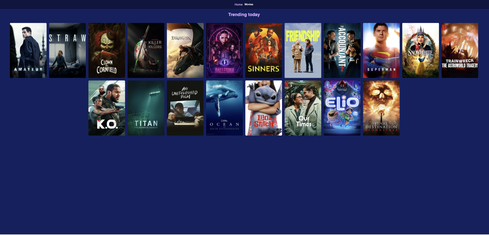

# React Movie Search

A responsive movie search app built with React and Vite. It uses The Movie Database (TMDb) API to display trending movies, search by title, and view detailed information for each movie.

🌐 Deployed on [Vercel](https://goit-react-hw-05-2fbpnv939-nina-kulyks-projects.vercel.app/)

---

## 🛠 Tech Stack

- React
- React Router
- Vite
- Axios
- React Toastify
- TMDb API

---

## ✨ Features

- Fully responsive layout: optimized for mobile, tablet, desktop, and even ultra-wide screens (e.g., TVs)
- Home page displaying trending movies
- Smooth hover effect on movie posters
- Search functionality with validation for empty input
- Detailed movie page with:
  - Movie overview
  - "Go back" button
  - Cast section
  - Reviews section
- Toast notification on invalid input

---

## 🚀 Live Demo

🔗 [View Live](https://goit-react-hw-05-2fbpnv939-nina-kulyks-projects.vercel.app/)

---

## 🖼️ Screenshots

|  **Mobile View** – compact layout for small screens. |  **Tablet View** – adaptive grid with intermediate sizing. |
|:--:|:--:|
|  |  |

---

|  **Desktop View** – full-width layout with responsive columns. |  **Search Results** – result grid after search query. |
|:--:|:--:|
|  |  |

---

|  **Validation** – prevents submission of empty queries. |  **Movie Details** – selected movie info with navigation. |
|:--:|:--:|
|  |  |

---

|  **Cast** – horizontal scroll with actor info. |  **Reviews** – user comments about the movie. |
|:--:|:--:|
|  |  |

---

|  **Ultra-wide Display** – layout stretches up to TV screen resolution. |
|:--:|
|  |
